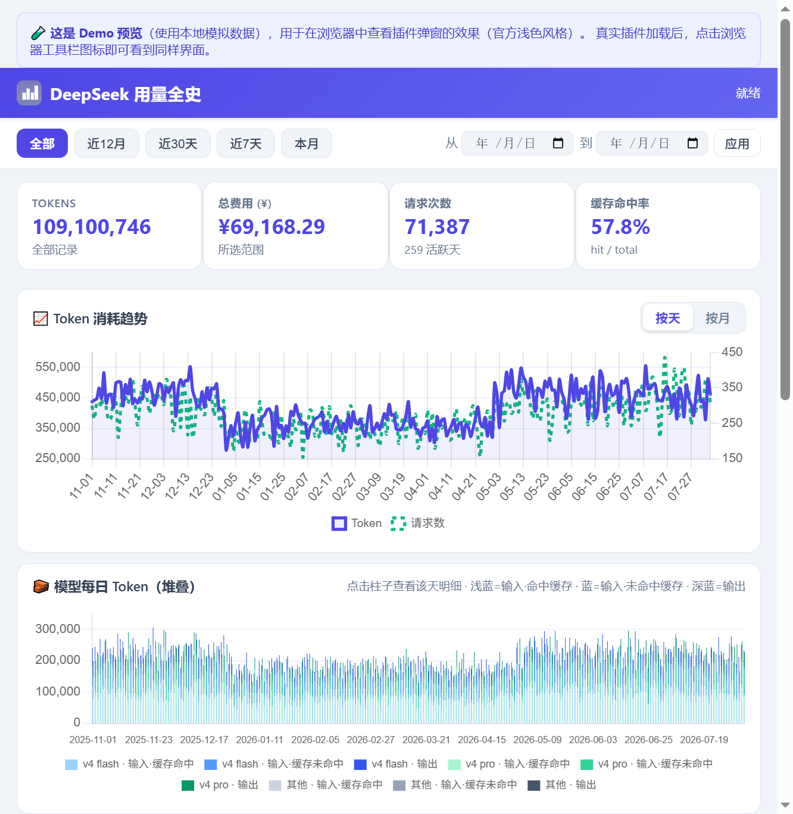

# 📊 DeepSeek 用量全史

> 一款 Chrome 浏览器扩展，**突破 DeepSeek 官网 30 天限制**，把你在平台上的全部 API 用量历史（Token、费用、请求次数）抓取下来，在浏览器里用图表永久查看。
>
> 所有数据**只保存在你自己的浏览器本地**，不上传任何服务器。



---

## 这是什么？

DeepSeek 开放平台（`platform.deepseek.com`）的用量页面只能同时显示**30天**的数据，历史数据过了 30 天就看不到了，一次性无法同时查看超过30天的数据。

这个扩展帮你：

- 🔓 **一键抓取全部历史**：从 2024 年 1 月起，逐月把每个月的用量明细拉取下来，永久保存在本地；
- 📈 **图表可视化**：Token 消耗趋势、模型用量分布、每日费用、按天热力图、每日各模型明细；
- 🔑 **按 API Key 汇总**：哪个 Key 花了多少钱、用了多少 Token、发了多少请求，一目了然；
- ⬇️ **导出 CSV**：把历史明细导出成文件，方便做自己的数据分析；
- 🔒 **全部本地存储**：数据存在浏览器 IndexedDB 里，任何时候都可以一键清空。

界面仿照 DeepSeek 官网用量页的**浅色靛蓝风格**，用起来很眼熟。

---

## 适用人群

- 用 DeepSeek API 开发、跑脚本、做研究的**个人开发者**；
- 关心自己或团队的 **API 花费**、需要做成本统计的人；
- 想搞清楚**哪个模型、哪个 Key 用量最多**的人。

---

## 如何安装（30 秒）

> 本扩展**未上架 Chrome 网上应用店**，需要用「加载已解压的扩展程序」方式本地安装。

1. 打开 Chrome 浏览器，在地址栏输入 `chrome://extensions` 并回车；
2. 打开页面右上角的 **「开发者模式」** 开关；
3. 点击左上角的 **「加载已解压的扩展程序」**；
4. 选择本文件夹（即存放 `manifest.json` 的那个文件夹）；
5. 安装成功后，浏览器工具栏会出现扩展图标 📊。

> 💡 **小提示**：安装后最好把扩展固定到工具栏（点拼图图标 🧩 → 找到本扩展 → 点 📌），方便随时点开。

---

## 如何使用

### 前置条件

- Chrome 浏览器；
- 一个 **DeepSeek 开放平台账号**，并且已经登录；
- **当前浏览器里**要有一个打开的、已登录的 `platform.deepseek.com` 标签页。

> ⚠️ 关键：扩展读取的是**当前浏览器登录状态**，所以必须先在这个浏览器里登录 DeepSeek 后台，再点同步。

### 第一步：登录 DeepSeek

打开 [platform.deepseek.com](https://platform.deepseek.com) 并登录（用量页 `platform.deepseek.com/usage` 也可以）。

### 第二步：同步历史数据

1. 点击浏览器工具栏的扩展图标 📊，打开弹窗；
2. 点击 **「🔄 同步全部历史」**；
3. 等待同步完成——会逐月拉取，首次通常**几十秒**，之后再次同步只拉「当月」和「新增月份」，非常快；
4. 完成后状态栏显示 `✅ 完成：新增 N、更新 M 条（X 个月）`，图表自动刷新。

> 🎯 之后每次打开弹窗，扩展会**自动静默同步当月**，无需手动操作。

### 第三步：查看你的用量

弹窗里你可以：

| 功能 | 怎么看 |
|---|---|
| **总览卡片** | 顶部：总 Token、总费用（¥）、请求次数、缓存命中率、活跃天数 |
| **Token 趋势图** | 「📈 Token 消耗趋势」，按天 / 按月切换 |
| **模型用量分布** | 「🥧 模型用量分布」，用量 / 花费两种视角 |
| **每日费用** | 「💰 每日费用」条形图，每天一根柱，可切换按模型堆叠 |
| **模型每日明细** | 「🧱 模型每日 Token（堆叠）」，看每天各模型的输入/输出比例 |
| **按天热力图** | 「🔥 按天花费热力图」，GitHub 风格，深浅表示花费多少 |
| **每日明细表** | 点击热力图任意一天 → 下方显示该天各模型的输出、缓存命中、命中率、花费 |
| **按 API Key 汇总** | 底部表格：每个 Key 的输入/输出 Token、费用、请求数 |

#### 筛选时间范围

- 顶部有快捷按钮：**全部 / 近12月 / 近30天 / 近7天 / 本月**；
- 也可以用日期选择器自定义「从…到…」，点「应用」即可。

### 第四步：导出 / 清除

- **⬇️ 导出 CSV**：把当前筛选范围内的所有明细导出为 `.csv` 文件（含月份、日期、模型、Key、类型、用量、单价、费用）。
- **🗑 清除**：一键清空本地所有数据（不可恢复，会弹确认框）。

---

## 常见问题（FAQ）

### Q1：点了同步，提示「未找到登录凭证」？

说明当前浏览器没有登录 DeepSeek。请先打开 `platform.deepseek.com` 并登录，再点同步。

### Q2：提示「认证失败，请刷新页面重新登录后重试」？

登录状态过期了。刷新一下 DeepSeek 页面（F5）重新登录，再同步即可。

### Q3：提示「Receiving end does not exist」？

多半是 DeepSeek 页面在**安装扩展之前**就打开了，扩展脚本没有注入进去。扩展会尝试自动注入；如果仍失败，**刷新一下 DeepSeek 页面**（F5）再点同步。

### Q4：同步很慢？

首次同步要逐月拉取所有历史（2024 年至今，每个月一个请求），几十秒属正常。之后增量同步就很快了。

### Q5：为什么有些月份显示「无数据」？

说明该月你没有产生 API 用量。这是正常的。

### Q6：数据存在哪里？安全吗？

存在浏览器本地的 **IndexedDB**（一个叫 `DeepSeekUsageDB` 的本地数据库）。**不上传任何服务器**，也不发送给第三方。任何时候都可以用弹窗里的「🗑 清除」一键删光。

### Q7：换了浏览器/电脑，数据还在吗？

不在。数据存在**当前浏览器的本地**，换浏览器或电脑相当于重新开始。用「导出 CSV」可以把数据带走。

### Q8：这个扩展会读取我的其他网站信息吗？

**不会。** 它只在 `platform.deepseek.com` 域名下运行，权限也仅限这一个域名（见下方「权限说明」）。

### Q9：DeepSeek 改版后同步不到数据了？

扩展调用的接口是后台页面自身使用的私有接口，DeepSeek 改版时可能变化。如果持续失败，先刷新页面重新登录；仍不行请在本仓库提 Issue。

### Q10：想彻底卸载？

`chrome://extensions` → 找到本扩展 → 移除即可。移除前如果想留数据，先「导出 CSV」。

---

## 🔒 权限与隐私说明

这个扩展**非常克制**，我们把它用到的每一项权限都解释清楚：

| 权限 | 用途 |
|---|---|
| `storage` / `unlimitedStorage` | 在浏览器本地保存用量历史（IndexedDB） |
| `scripting` | 在 DeepSeek 页面注入采集脚本 |
| 访问 `platform.deepseek.com/*` | **唯一的**网络权限，只和 DeepSeek 官方域名通信 |

**隐私承诺：**

- ❌ 不收集任何个人信息；
- ❌ 不发送任何数据到第三方服务器；
- ❌ 无遥测、无统计、无广告；
- ✅ 你的登录凭证（`userToken`）只用于向 DeepSeek 官方接口请求你自己的用量数据，**绝不出现在任何存储或日志里**；
- ✅ 所有数据 100% 保存在你自己浏览器本地。

---

## 工作原理（给好奇的人）

扩展在 `platform.deepseek.com` 页面内运行，复用你已登录的会话凭证，直接调用后台自身使用的接口：

```
GET /api/v0/usage/export?start=<utc>&end=<utc>&tz=0
    → 返回 ZIP，内含 amount-*.csv（每行：utc_date, model, api_key_name, type, price, amount）

GET /api/v0/usage/amount?month=&year=   ← CSV 导出不可用时的 JSON 兜底
```

逐月抓取后，按 `(月份, 日期, 模型, Key, 类型)` 去重写入本地 IndexedDB，保证重复同步不会数据翻倍。

> 注：这些是后台页面自身使用的**非公开接口**，DeepSeek 改版时可能变化。

---

## 项目结构

```
deepseek用量插件/
├── manifest.json          # 插件配置（Manifest V3）
├── background.js          # 后台：IndexedDB 存储 + 消息路由
├── content.js             # 采集引擎：读登录态、抓用量数据
├── lib/
│   ├── csv.js             # CSV 解析（零依赖）
│   ├── fflate.umd.js      # ZIP 解压（解析官方导出包）
│   └── chart.umd.min.js   # Chart.js v4.4.7 图表库
├── popup/
│   ├── popup.html         # 弹窗界面
│   ├── popup.js           # 图表渲染与交互
│   └── popup.css          # 样式
├── icons/                 # 扩展图标（16/48/128）
├── screenshot*.png        # 界面预览图
└── 开发者文档.md           # 面向开发者的技术文档
```

---

## 🛠 开发者文档

安装、测试、打包等面向开发者的技术细节，见 [开发者文档.md](开发者文档.md)。

## 📄 开源

本项目遵循 **MIT License** 开源。你可以自由使用、修改、分发、商用，只需保留版权声明。

---

*如果你觉得这个扩展有用，欢迎给仓库点个 ⭐，或在 Issue 里反馈问题与建议。*
## 注：本项目完全由Agent开发

agent：claude桌面版
模型：deepseek-v4-flash 0731
思考强度：max